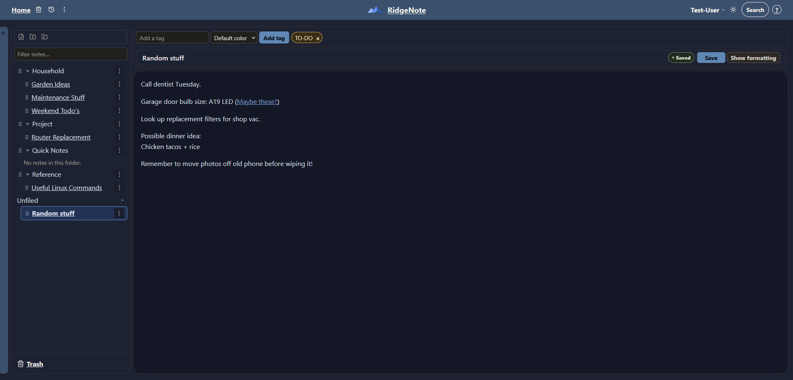
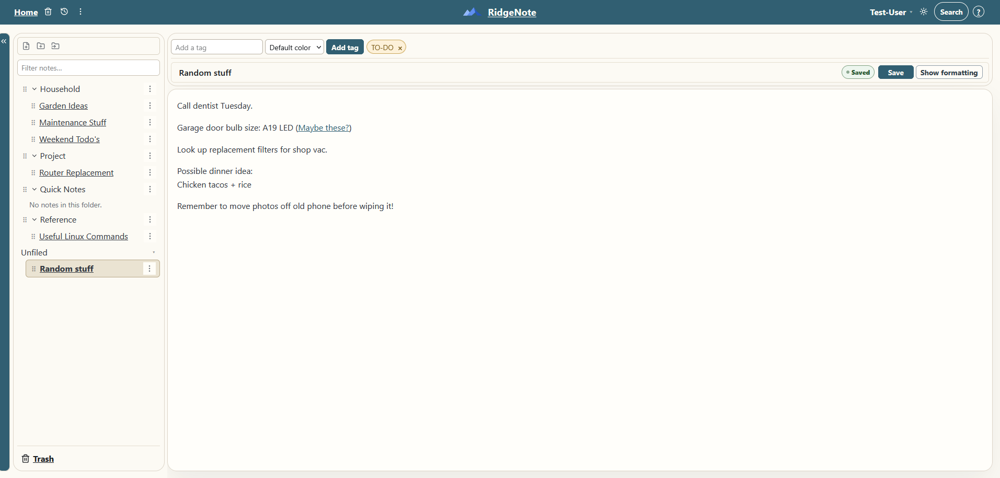
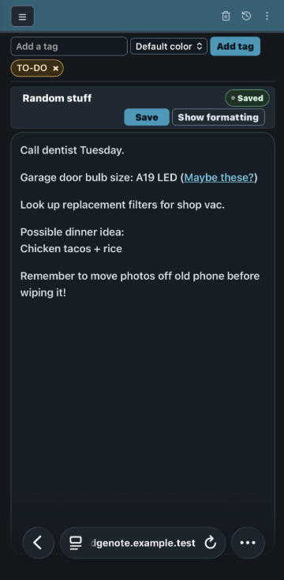

# RidgeNote

*A lightweight, self-hosted notes application that keeps your notes under your control.*

RidgeNote is a browser-based, multi-user notes application for straightforward everyday note-taking. It combines rich-text editing, folders, tags, full-text search, Trash and recovery, user accounts, selectable themes, and built-in backup/restore tools in a simple Docker Compose deployment.

RidgeNote is intentionally focused on notes rather than document management. It is not intended to be a wiki, collaborative office suite, or full document-versioning system.

---

## Why RidgeNote Exists

I have spent most of my adult life with a pile of random pieces of paper stacked all around my desk in little piles. I would need to jot something down quickly. Things like contact information, a random idea, something I needed to be able to recall later, a website address, etc. You get the idea.

The problem with that approach for me was a few things. First, those little scraps of paper would pile up over time and make a mess. When I needed to find some little piece of information I had written down later, I'd have trouble finding it. And then, every once in a while, I would decide (usually on a whim) that it was time to clean up my desk and get rid of all that paper.

Sure, I would take a moment and glance at both sides of each piece of paper to make sure I wasn't throwing out anything I still needed. And nearly every time, I missed something important and threw it out anyway.

For a while, I tried using my personal favorite notes application, Trilium Notes. But my main use for Trilium is deep, complex, organized notes that are meant to be more permanent. More like a personal knowledge base. After a while of adding my scratch notes to Trilium, I found I was cluttering up my more important and well-organized Trilium notes with temporary “scratch” notes and making a digital mess of things in the process.

So, I decided that I wanted an app dedicated to just scratch notes. There are some other apps out there for this purpose, but none of the ones I found really suited me. So, I decided to create my own. 🙃

RidgeNote started out as a personal project for the very purpose of giving me a place to put all my scratch notes and to finally rid myself of all of those paper notes laying around all over the place. It was built around the way I wanted to keep and organize scratch notes. Its features and design reflect those needs first rather than an attempt to build a general-purpose productivity platform.

As I was building RidgeNote, some friends and family saw what I was doing, liked it, and wanted in on the action. So, I decided to share RidgeNote in case other people find the same approach useful.

That also means its scope is intentionally opinionated: features are added when they fit the kind of simple, self-hosted note system RidgeNote was created to be, rather than simply because another notes application has them. Meaning, I may or may not add more features in the future.

---

## Features

1. Plain and Rich-text notes with autosave
2. Simple folder-based organization with tree navigation
3. Tags with configurable colors (just because)
4. Full-text search and advanced filtering
5. Trash, restore, and administrator recovery
6. Note duplication, printing, and text download
7. Multiple user accounts with administrator controls
8. Invitation-based onboarding
9. Selectable themes and per-user preferences
10. User controlled Library Backup and restore
11. Responsive layouts for desktop, tablet, and phone
12. Self-hosted Docker Compose deployment

---

## Screenshots

### Desktop



| Warm Light | Mobile |
| --- | --- |
|  |  |

---

## Quick Start

RidgeNote is distributed as a Docker Compose application.

For the recommended deployment path, see [Quick Deploy](deploy/README.md), which covers the required environment settings, application startup, and first-run setup.

At a high level:

1. Prepare the deployment directory with `docker-compose.yml` and `.env`.
2. Start RidgeNote with Docker Compose.
3. Open RidgeNote in your browser.
4. Create the initial administrator.

Do not expose RidgeNote or PostgreSQL directly to the public Internet. If RidgeNote will be reachable from outside your trusted network, use HTTPS and a properly configured reverse proxy or another protected access method.

---

## Deployment Compatibility

RidgeNote is packaged as a Docker Compose application and should run on most modern systems capable of running Docker and Docker Compose.

That includes common Linux distributions such as Ubuntu and Debian, and should also include Windows systems running Docker. RidgeNote does not depend on host-installed Python, Node.js, PostgreSQL, or other application runtimes outside the container stack.

RidgeNote V1 is currently published with `linux/amd64` container images. Other CPU architectures are not currently provided as prebuilt images.

---

## Validated Environments

RidgeNote has been directly tested on Ubuntu 24.04 LTS with Docker Engine and Docker Compose.

Current Chromium-family browsers and Firefox have been tested. Safari has not been extensively validated but should work.

Other Docker-capable operating systems and browser combinations may work normally, but should be considered unvalidated unless specifically noted in the documentation.

---

## Security and Internet Exposure

RidgeNote is designed to be used primarily in internal, trusted, self-hosted environments. As such, we focused on practical application-level protections appropriate to that use case, including account controls, login lockouts, session handling, ownership isolation, CSRF protection, and related safeguards. Broader Internet-facing hardening such as general rate limiting and additional perimeter protections was not a primary V1 design goal.

You can do it (I do), but if you decide to expose it, I strongly recommend taking additional precautions to protect it.

If RidgeNote is reachable from outside your trusted network, I recommend you place it behind a properly configured reverse proxy or equivalent secure access layer and use HTTPS.

Do not expose PostgreSQL directly to the Internet, use strong credentials, keep the host and containers updated, and maintain current backups.

The deployment documentation includes guidance for reverse-proxy configuration and related security settings. Operators are responsible for securing the surrounding host, network, and exposure path.

---

## Backup and Recovery

RidgeNote provides several built-in layers of protection against accidental data loss.

- Library Backup and restore lets individual users export and restore their RidgeNote library.
- Trash and restore provide protection against normal accidental deletion.
- Administrator recovery provides an additional recovery window for eligible deleted content.

Library Backup is intended for user-level portability and recovery. It is not a full backup of RidgeNote application or underlying database.

For full-instance disaster recovery, you should use whatever host, VM, container, or infrastructure-level backup method is appropriate for your environment.

Advanced PostgreSQL backup and restore guidance is also included in the operator documentation, but that path is intended for operators comfortable with PostgreSQL. RidgeNote is not a database administration product, and docs should not be interpreted as promise of maintainer support for DB corruption/arbitrary PostgreSQL recovery problems.

---

## Documentation

- [Quick Deploy](deploy/README.md) — The shortest path to getting RidgeNote running with Docker Compose.
- [Deployment and Operator Guide](docs/RUNBOOK_DEPLOYMENT.md) — Full deployment configuration, reverse-proxy setup, upgrades, troubleshooting, and operational guidance.
- [Architecture](ARCHITECTURE.md) — A concise overview of RidgeNote's application structure, data-integrity principles, runtime model, security boundaries, and contributor design constraints.
- [Backup and Restore Runbook](docs/RUNBOOK_BACKUP_RESTORE.md) — Advanced PostgreSQL-level backup and recovery procedures for self-hosted operators.
- [Trash and Purge Operations](docs/RUNBOOK_PURGE.md) — Trash lifecycle, automatic purge configuration, manual purge operations, and recovery considerations.
- [V1 Release Notes](docs/RELEASE_NOTES_V1.md) — V1 capabilities, deployment model, limitations, and release information.
- [V1 Validation Results](docs/ACCEPTANCE_RESULTS_V1.md) — Automated, functional, browser, and standalone-deployment validation performed for the V1 release.
- [Third-Party Notices](THIRD_PARTY_NOTICES.md) — Dependency licensing, attribution, and release-compliance information.

---

## Development

The RidgeNote repository contains the complete application source and development environment.

RidgeNote is built with Django, PostgreSQL, TypeScript, Vite, and Vitest. Local development uses the root `docker-compose.yml`, which builds RidgeNote from source and runs the application, PostgreSQL, and scheduler together.

For a basic local development environment:

1. Clone the repository.
2. Copy `.env.example` to `.env` if you want to override the supplied development defaults.
3. Build and start the stack:

```sh
docker compose build
docker compose up -d
```

4. Open `http://127.0.0.1:8000/`.

Pending Django migrations are applied automatically during normal container startup.

The root Compose configuration is intended for development. For a normal standalone installation using published RidgeNote images and persistent host storage, use [Quick Deploy](deploy/README.md) instead.

---

## Development Approach

I am not a software developer by trade. My background is in systems administration and systems engineering, and RidgeNote was built with extensive assistance from AI coding tools, which handled a large portion of the hands-on implementation.

That background played a big role in how the project was approached. I leaned heavily on the same habits I use when working with servers and infrastructure: make changes in small pieces, understand what is changing before accepting it, keep backups and rollback paths in mind, test before moving on, and stop when something behaves differently than expected.

RidgeNote was not built by simply asking an AI to “make me a notes app” and accepting whatever came back. Features were discussed and designed before implementation, changes were reviewed, automated tests were run throughout development, user-facing work was manually tested, and unexpected results usually stopped the process until we understood what happened.

AI was used as the coder, reviewer, and sometimes the second set of eyes, but not as the product owner. I decided what RidgeNote should do, how it should behave, what changes were acceptable, and when something was ready to move forward.

I’m sharing that openly because RidgeNote is very much an AI-assisted project, but I also think there is an important difference between using AI as a development tool and blindly trusting whatever it generates.

I still expect bugs, rough edges, and things I simply have not thought of. RidgeNote was originally built for my own use and for friends and family, and I am sharing it with the community because someone else may find it useful too.

---

## License

RidgeNote is licensed under the Apache License 2.0.

See [LICENSE](LICENSE) for the full license text.
